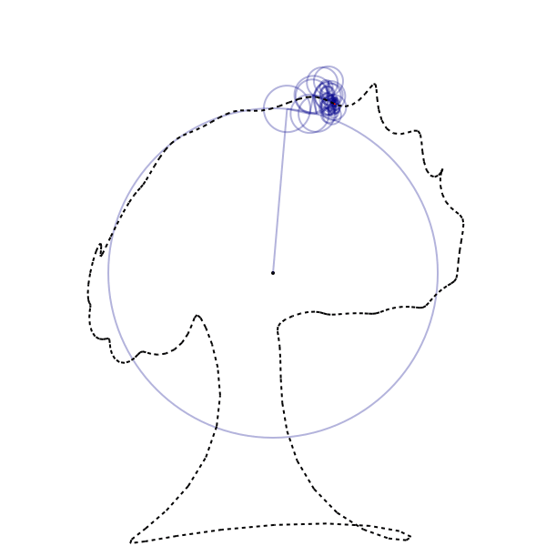

# Fourier Funcinator 

Converts a SVG image into the complex Fourier series. See the [wikipedia page](https://en.wikipedia.org/wiki/Fourier_series) for more information

The `path` object contains all the points to approximate the Fourier series on, and the `series` object contains the complex amplitudes of each term in the Fourier series.

### Usage
Built for Julia v1.9.2 and up, but lower versions may also work. Simply import the module and you're away. Some example code is given in `runner.jl`.

```julia
using Fourier

# Load the path and generate the series
path = Fourier.load("FILENAME.svg")
series = Fourier.series(path, 30)

# To output a pasteable function for desmos.com use
println(Fourier.todesmos(series))

# Otherwise to generate a .gif animation
Fourier.animate_series(series, fname="FILENAME.gif", frames=600)
```

### Examples




